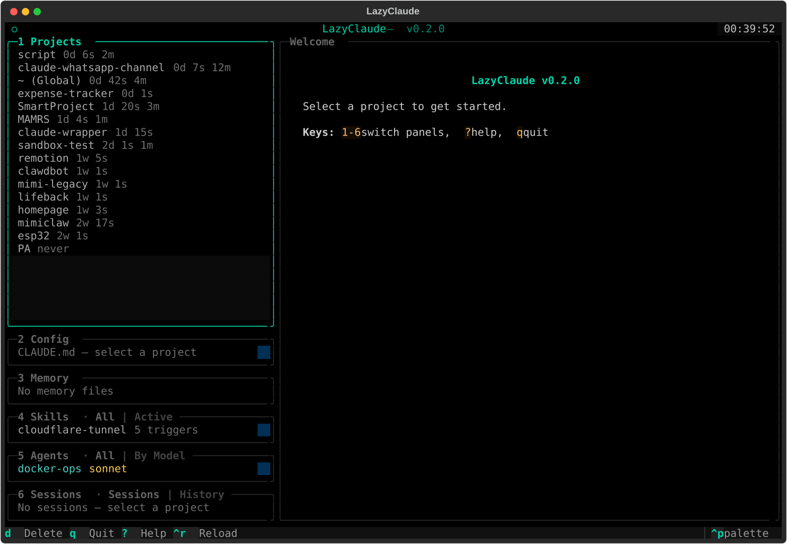
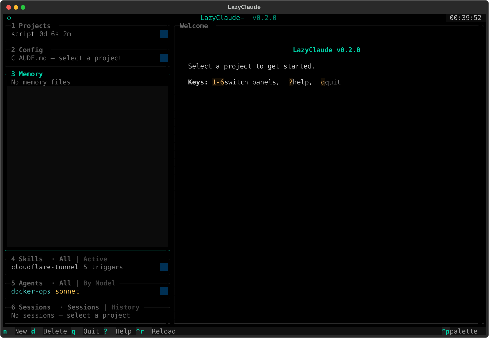
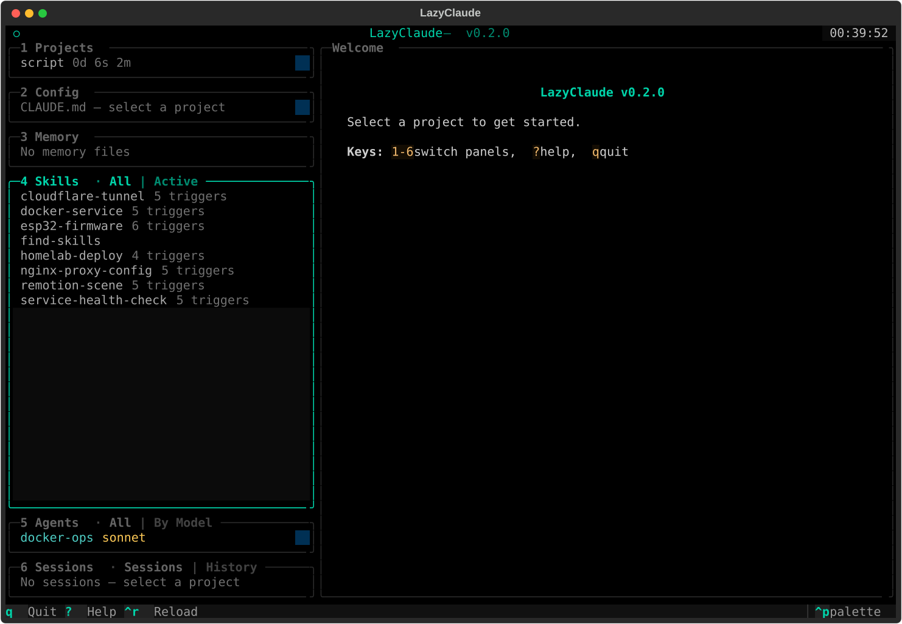
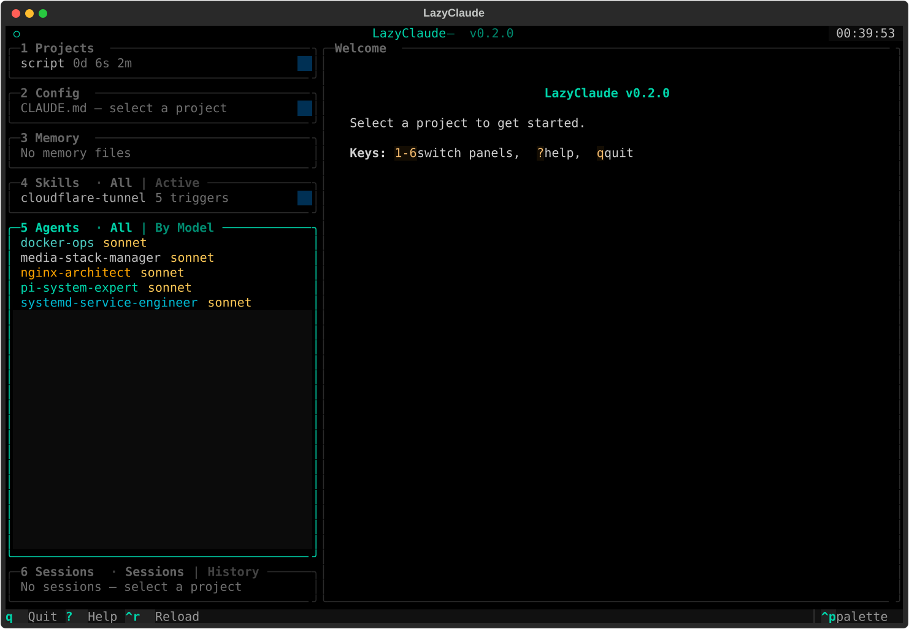
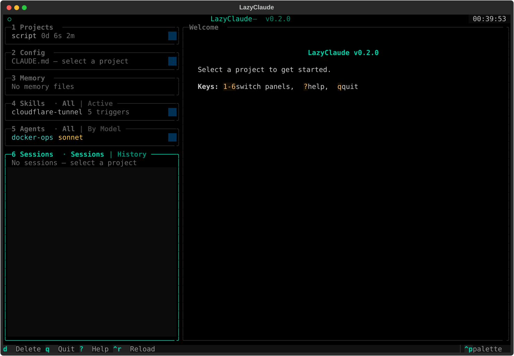
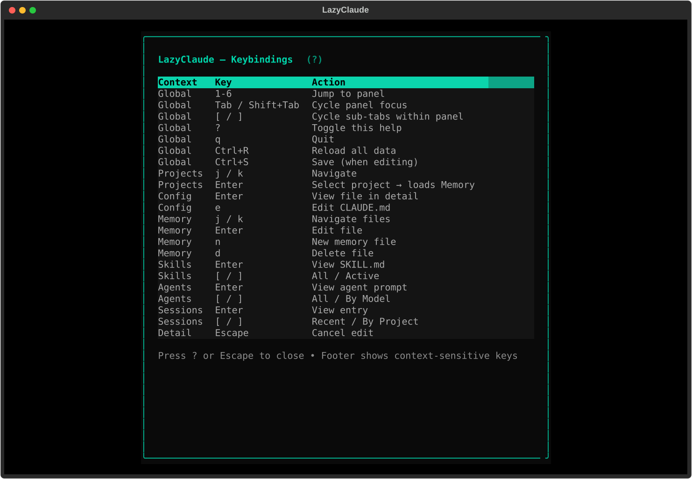

# LazyClaude

A [LazyGit](https://github.com/jesseduffield/lazygit)-inspired terminal UI for managing the `.claude` directory ecosystem.

LazyClaude gives Claude Code power users a single, panel-based interface to browse and manage projects, memory files, skills, agents, settings, and session history — all from one TUI.


## Features

- **6 navigable panels** — Projects, Config, Memory, Skills, Agents, Sessions
- **LazyGit-style layout** — stacked panels on the left, context-sensitive detail pane on the right
- **Active panel expands**, inactive panels collapse to 2 lines
- **Dynamic footer** — keybindings update based on the focused panel
- **OLED-optimized theme** — true black `#000000` background with teal `#00d4aa` accents
- **Memory CRUD** — create, edit, delete memory files with MEMORY.md auto-sync
- **Session management** — browse and delete old transcript files
- **Project cleanup** — delete project data (sessions + memory) without touching your code
- **Debounced navigation** — detail pane only renders after you stop scrolling
- **Backup before write** — all edits are backed up to `~/.claude/backups/lazyclaude/`

## Screenshots

### Project loaded with CLAUDE.md preview



### Memory panel — browse and edit memory files



### Skills panel — view auto-trigger keywords



### Agents panel — color-coded with model badges



### Sessions panel — transcript files with sizes



### Help overlay



## Installation

Requires Python 3.12+ with [Textual](https://github.com/Textualize/textual) and PyYAML.

### From source (recommended)

```bash
git clone https://github.com/pibytectl/lazyclaude.git
cd lazyclaude
pip install -e .
```

### Run

```bash
lazyclaude
```

Or:

```bash
python -m lazyclaude
```

## Keybindings

### Global

| Key | Action |
|-----|--------|
| `1` - `6` | Jump to panel |
| `Tab` / `Shift+Tab` | Cycle panel focus |
| `[` / `]` | Cycle sub-tabs within a panel |
| `?` | Help overlay |
| `q` | Quit |
| `Ctrl+R` | Reload all data |
| `Ctrl+S` | Save (when editing) |

### Projects (1)

| Key | Action |
|-----|--------|
| `j` / `k` | Navigate |
| `Enter` | Load project (memory, sessions, config) |
| `d` | Delete project data |

### Config (2)

| Key | Action |
|-----|--------|
| `Enter` | View selected file in detail pane |
| `e` | Edit CLAUDE.md |

### Memory (3)

| Key | Action |
|-----|--------|
| `j` / `k` | Navigate files |
| `Enter` | Edit file |
| `n` | Create new memory file |
| `d` | Delete file |

### Skills (4)

| Key | Action |
|-----|--------|
| `Enter` | View SKILL.md |
| `[` / `]` | Toggle All / Active |

### Agents (5)

| Key | Action |
|-----|--------|
| `Enter` | View agent prompt |
| `[` / `]` | Toggle All / By Model |

### Sessions (6)

| Key | Action |
|-----|--------|
| `Enter` | View session details |
| `d` | Delete transcript file |
| `[` / `]` | Toggle Sessions / History |

## Panel Layout

```
╭ 1 Projects ─────────────╮╭ Detail ──────────────────────────────╮
│> script        0d 5s 2m  ││                                     │
│  SmartProject  0d 20s 3m ││  Context-sensitive content:          │
│  whatsapp-ch…  0d 7s 12m ││                                     │
╰──────────────────────────╯│  Projects → project summary          │
╭ 2 Config ────────────────╮│  Config   → CLAUDE.md / settings     │
│  CLAUDE.md (script)      ││  Memory   → file preview             │
╰──────────────────────────╯│  Skills   → SKILL.md body            │
╭ 3 Memory ────────────────╮│  Agents   → agent system prompt      │
│  USR User profile        ││  Sessions → session metadata         │
│  PRJ Oracle Cloud VM     ││                                     │
╰──────────────────────────╯│                                     │
╭ 4 Skills ────────────────╮│                                     │
│  nginx-proxy-config      ││                                     │
╰──────────────────────────╯│                                     │
╭ 5 Agents ────────────────╮│                                     │
│  docker-ops sonnet       ││                                     │
╰──────────────────────────╯│                                     │
╭ 6 Sessions ──────────────╮│                                     │
│  4260e49f… 1891KB        ││                                     │
╰──────────────────────────╯╰──────────────────────────────────────╯
```

- **Active panel**: teal border, expanded to fill space
- **Inactive panels**: dim border, collapsed to ~2 lines
- **Sidebar badges**: `5s` = 5 sessions, `2m` = 2 memory files
- **Memory types**: `USR` (user), `PRJ` (project), `FDB` (feedback), `REF` (reference)

## What it manages

LazyClaude reads and writes files in `~/.claude/`:

| Component | Path | What LazyClaude does |
|-----------|------|---------------------|
| Projects | `~/.claude/projects/` | List, load, delete project data |
| Memory | `~/.claude/projects/<name>/memory/` | Browse, create, edit, delete `.md` files |
| Config | `~/.claude/CLAUDE.md`, `settings.json` | View, edit CLAUDE.md; browse settings tree |
| Skills | `~/.claude/skills/*/SKILL.md` | Browse skills, view auto-triggers |
| Agents | `~/.claude/agents/*.md` | Browse agent prompts, model/color info |
| Sessions | `~/.claude/projects/<name>/*.jsonl` | Browse transcripts, delete old ones |
| History | `~/.claude/history.jsonl` | Browse recent prompt history |

## Design Principles

1. **Read-first, write-safe** — destructive operations (delete, overwrite) require `y/n` confirmation. All writes are backed up first.
2. **LazyGit feel** — same navigation patterns: number keys for panels, `j`/`k` for items, `Enter` to select, `[`/`]` for sub-tabs.
3. **Offline-first** — no API calls. Reads/writes files directly.
4. **OLED-optimized** — true black background for pixel-off power savings. High-contrast teal selection bar.
5. **Fast navigation** — detail pane updates are debounced (120ms). Content is lazy-loaded on demand.

## Tech Stack

- **Python 3.12+** with [Textual](https://github.com/Textualize/textual) TUI framework
- **PyYAML** for YAML frontmatter parsing
- No other dependencies

## Project Structure

```
src/lazyclaude/
  app.py               # Main Textual App — layout, bindings, event routing
  claude_dir.py         # Filesystem I/O for ~/.claude/
  models.py             # Dataclasses: Project, MemoryFile, Skill, Agent, etc.
  history.py            # JSONL parser for history and sessions
  theme.py              # OLED TCSS theme
  widgets/
    panel_widget.py     # Base PanelWidget + all 6 panel implementations
    detail_pane.py      # Context-sensitive right pane (Markdown/Tree/Text)
    memory_browser.py   # Modals for memory creation and deletion
    help_overlay.py     # ? keybinding reference
```

## License

MIT
